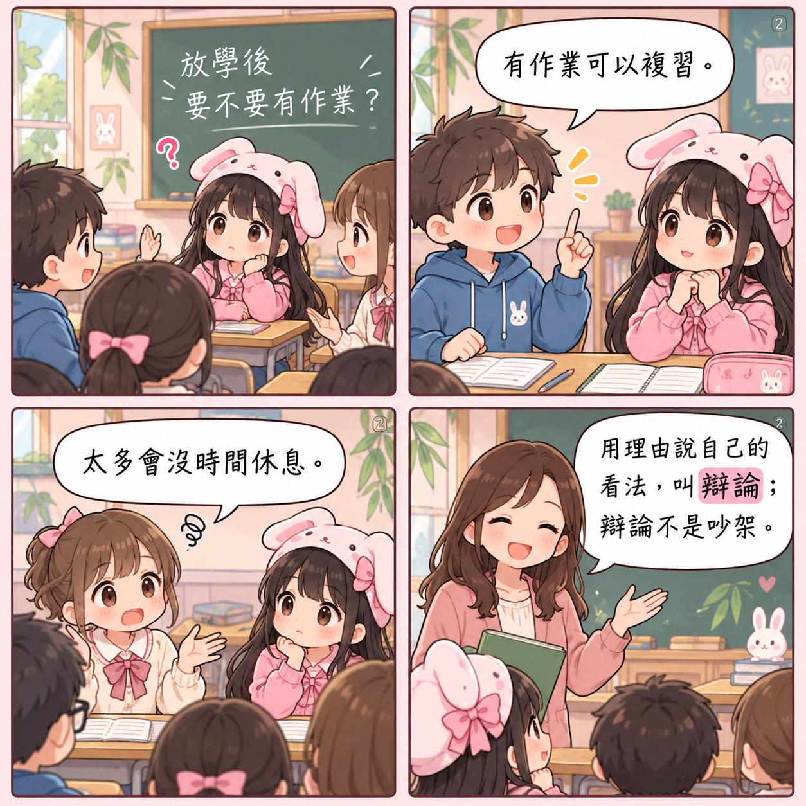
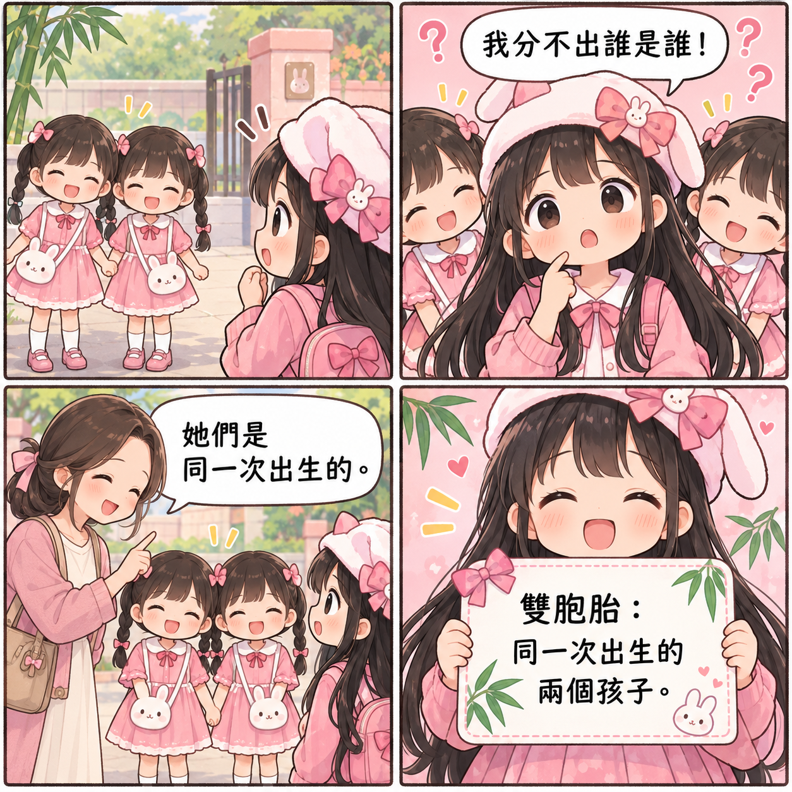
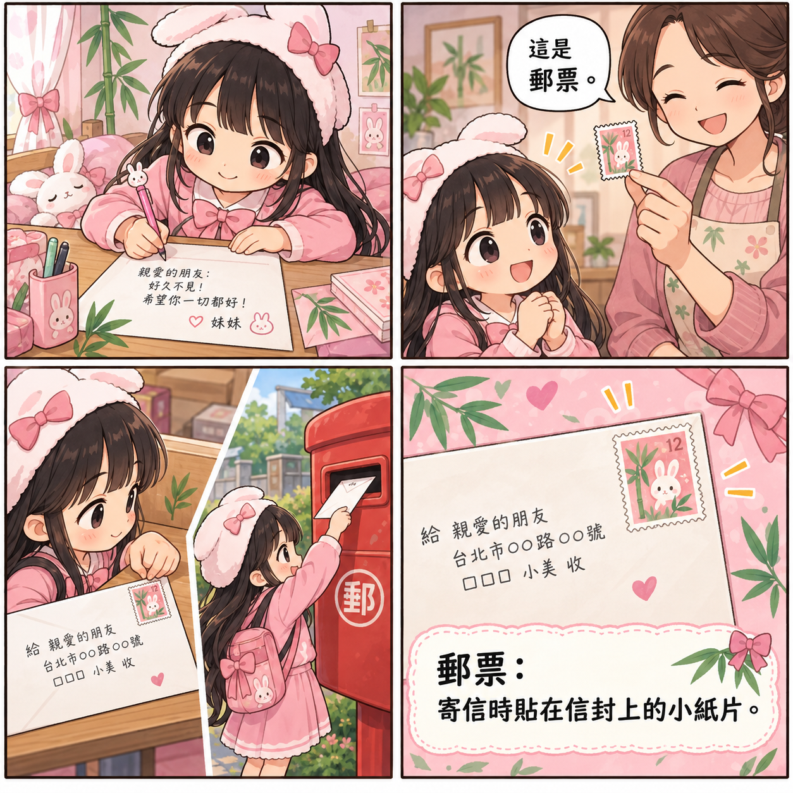
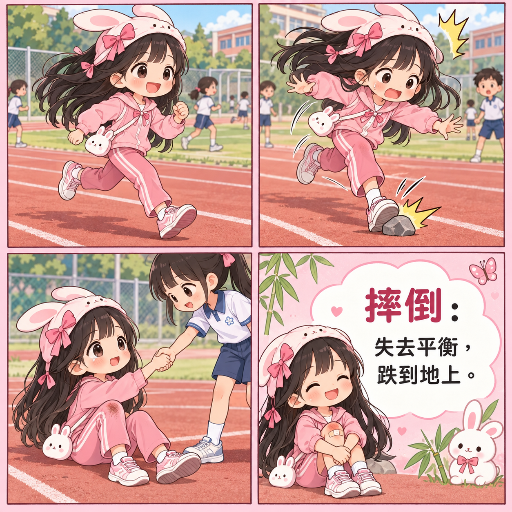
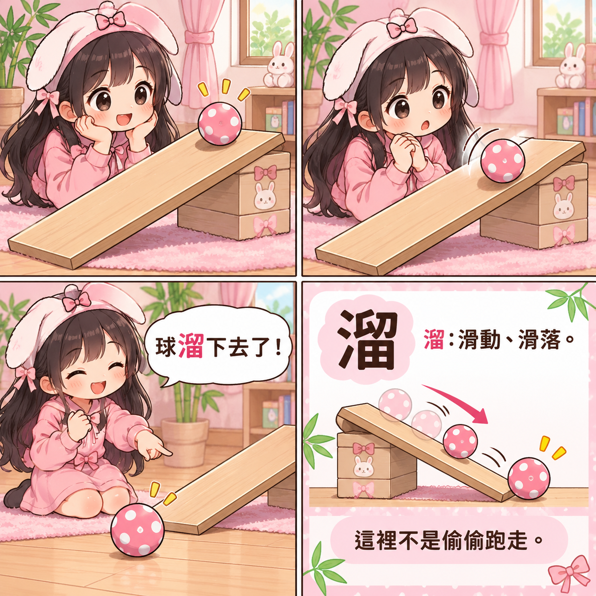
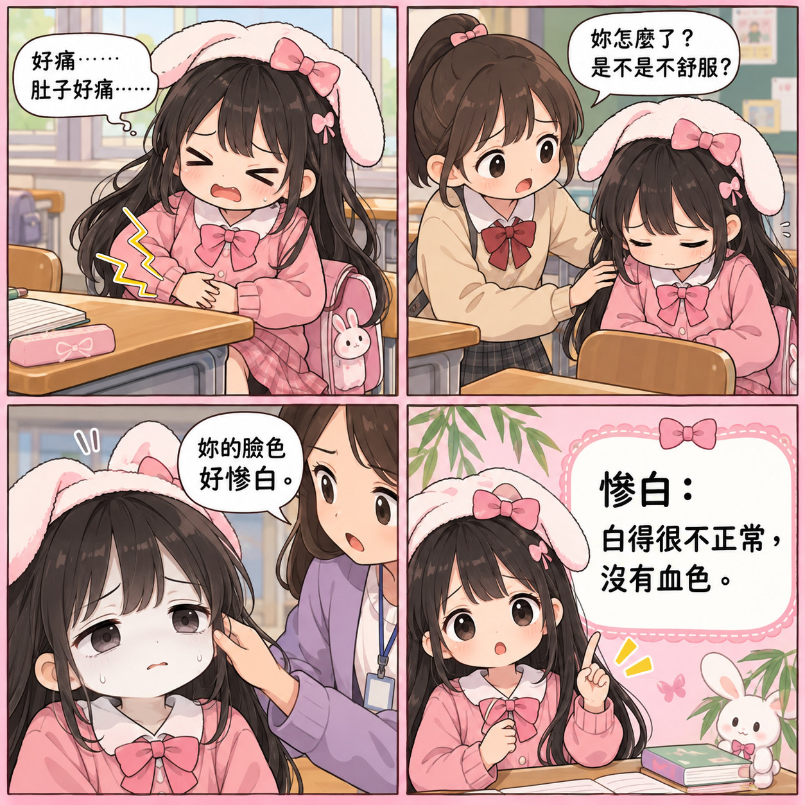
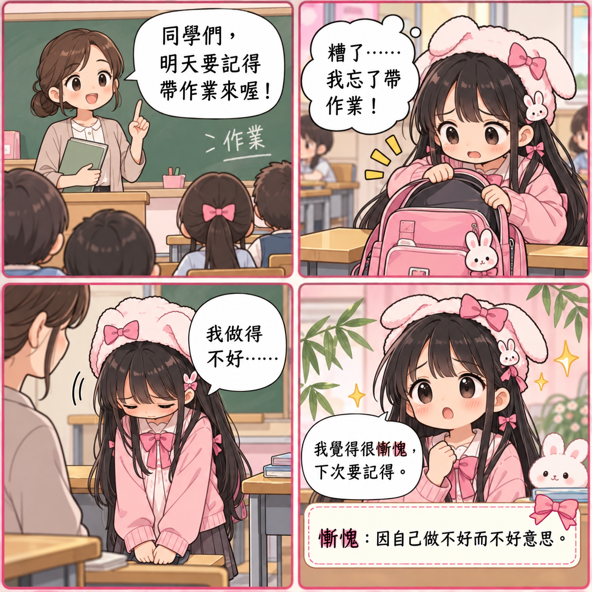
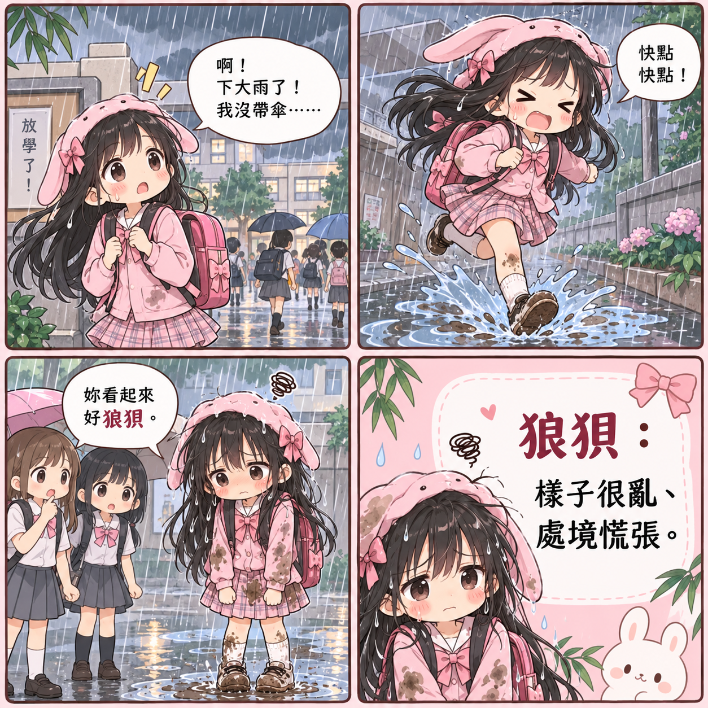
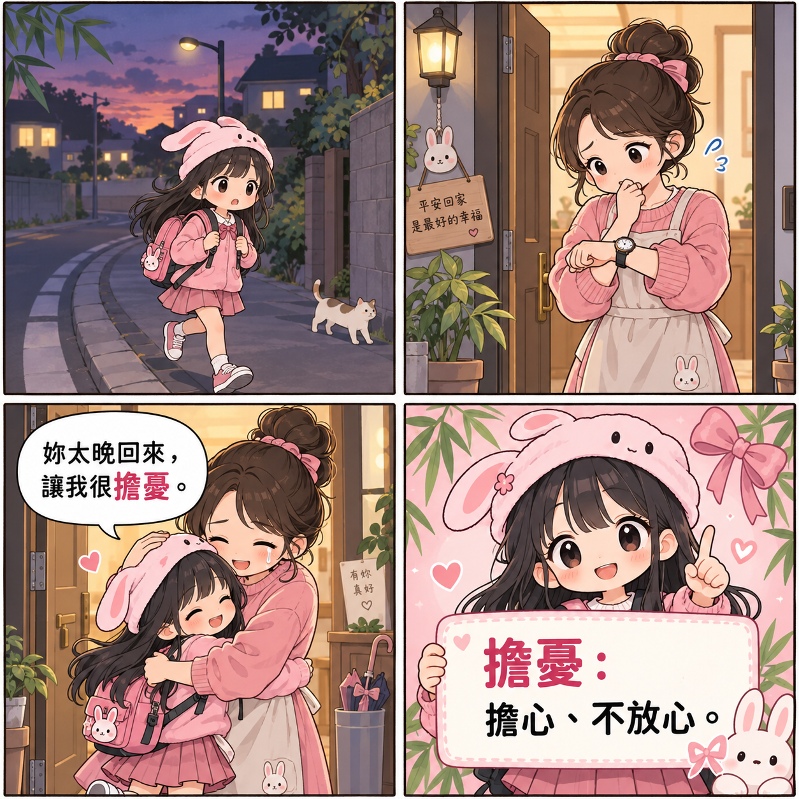

# 🪲 Beetle Reading Lab

## 國語第二課詞語情境漫畫

### 詞語 → 畫面 → 情境 → 使用

> **不是只背詞語解釋，**
>
> **而是看到生活情境時，知道這個詞語怎麼用。**

---

# 🌸 這一組漫畫要練什麼？

這一組收錄國語第二課的 11 個詞語：

- 眼眶
- 固執
- 辯論
- 雙胞胎
- 郵票
- 摔倒
- 溜
- 慘白
- 慚愧
- 狼狽
- 擔憂

每張漫畫只教一個詞語，透過四格情境讓妹妹依序看見：

> **發生什麼事 → 人物怎麼反應 → 詞語放在哪裡 → 詞義是什麼**

---

# 📚 漫畫索引

| 編號 | 詞語 | 核心意思 | 圖片 |
|---:|---|---|---|
| 01 | 眼眶 | 眼睛外面一圈的地方 | [查看漫畫](01_國語第二課_眼眶.png) |
| 02 | 固執 | 一直堅持自己的想法，不肯改變 | [查看漫畫](02_國語第二課_固執.png) |
| 03 | 辯論 | 用理由說明自己的看法 | [查看漫畫](03_國語第二課_辯論.png) |
| 04 | 雙胞胎 | 同一次出生的兩個孩子 | [查看漫畫](04_國語第二課_雙胞胎.png) |
| 05 | 郵票 | 寄信時貼在信封上的小紙片 | [查看漫畫](05_國語第二課_郵票.png) |
| 06 | 摔倒 | 失去平衡，跌到地上 | [查看漫畫](06_國語第二課_摔倒.png) |
| 07 | 溜 | 滑動、滑落 | [查看漫畫](07_國語第二課_溜.png) |
| 08 | 慘白 | 白得很不正常，沒有血色 | [查看漫畫](08_國語第二課_慘白.png) |
| 09 | 慚愧 | 因為自己做得不好而感到不好意思 | [查看漫畫](09_國語第二課_慚愧.png) |
| 10 | 狼狽 | 樣子很亂，處境慌張 | [查看漫畫](10_國語第二課_狼狽.png) |
| 11 | 擔憂 | 擔心、不放心 | [查看漫畫](11_國語第二課_擔憂.png) |

---

# 🎨 01｜眼眶

妹妹看感人的影片，眼睛泛淚，眼睛周圍也紅了。

> **眼眶：眼睛外面一圈的地方。**

---

# 🎨 02｜固執

同學提出建議，妹妹卻堅持原來的方法，不願意調整。

> **固執：一直堅持自己的想法，不肯改變。**

---

# 🎨 03｜辯論

同學針對「放學後要不要有作業」提出不同意見，並分別說明理由。

> **辯論：用理由說明自己的看法；辯論不是吵架。**

---

# 🎨 04｜雙胞胎

妹妹遇見兩個長得很像，而且是同一次出生的孩子。

> **雙胞胎：同一次出生的兩個孩子。**

---

# 🎨 05｜郵票

妹妹寫好信，把郵票貼在信封上，再投入郵筒。

> **郵票：寄信時貼在信封上的小紙片。**

---

# 🎨 06｜摔倒

妹妹跑步時踩到石頭、失去平衡，跌坐在地上。

> **摔倒：失去平衡，跌到地上。**

---

# 🎨 07｜溜

球沿著斜面慢慢往下滑，最後滑落到地面。

> **溜：滑動、滑落。**

這裡的「溜」是滑動，不是偷偷跑走。

---

# 🎨 08｜慘白

妹妹突然肚子痛，臉色白得不正常，看起來沒有血色。

> **慘白：白得很不正常，沒有血色。**

---

# 🎨 09｜慚愧

妹妹忘記帶作業，知道自己沒有做好，感到很不好意思。

> **慚愧：因為自己做得不好而感到不好意思。**

---

# 🎨 10｜狼狽

妹妹遇到大雨又踩進水坑，全身濕、頭髮亂、鞋子也髒了。

> **狼狽：樣子很亂，處境慌張。**

---

# 🎨 11｜擔憂

天色已晚，妹妹還沒回家，媽媽一直看時間，心裡很不放心。

> **擔憂：擔心、不放心。**

---

# 🧠 使用方式

## 第一次閱讀｜看懂情境

先遮住第 4 格，請妹妹回答：

1. 發生了什麼事？
2. 人物的表情或動作告訴你什麼？
3. 你覺得這張漫畫要教哪個詞語？

## 第二次閱讀｜主動提取

看完漫畫後闔上圖片，請妹妹用自己的話解釋詞語。

## 第三次閱讀｜換情境使用

請妹妹再想一個不同的生活例子，並用詞語造句。

---

# ✅ 學習檢查

不是只問「妳記得解釋嗎？」也可以問：

- 哪一格最能表現這個詞語？為什麼？
- 如果改變其中一個條件，還能使用這個詞語嗎？
- 有沒有一個看起來很像、其實不能用這個詞語的反例？
- 妳可以用這個詞語說一句自己的生活經驗嗎？

---

## 🌷 Beetle Reading Lab

### 看見情境，理解詞義，真正會用。

